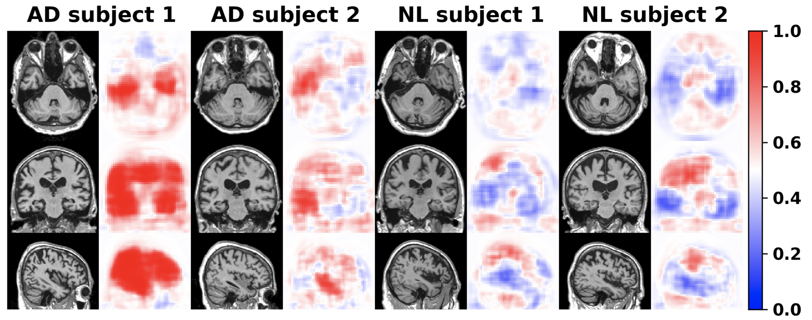
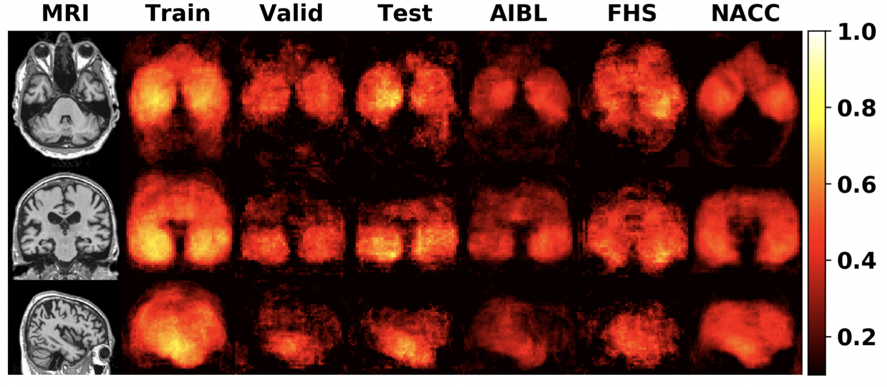
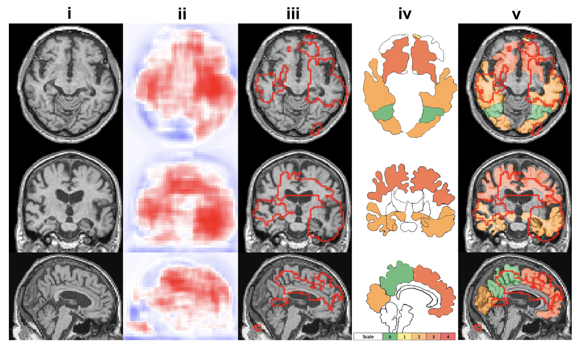
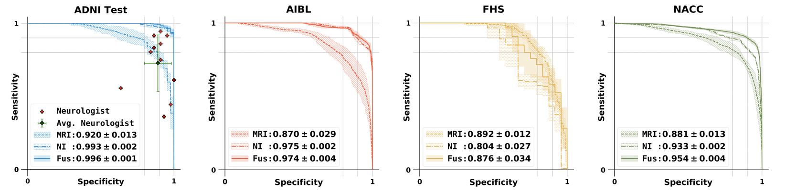
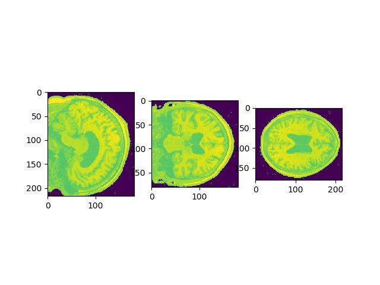

# Development and validation of an interpretable deep learning framework for Alzheimer’s disease classification

This work is published in _Brain_ (https://doi.org/10.1093/brain/awaa137).

## Introduction

This repo contains a PyTorch implementation of a deep learning framework that delineates explainable Alzheimer’s disease signatures (3D disease risk map) from magnetic resonance imaging which are then integrated with multimodal inputs, including age, gender, and mini-mental state examination score. Our framework links a fully convolutional network (FCN) to a multilayer perceptron. The FCN generates patient specific 3D disease risk map (dense local predictions) see below. 

 

The FCN model was developed on ADNI training and validation sets and its performance was evaluated on ADNI testing set, 3 external testing datasets, including NACC, AIBL and FHS datasets. The Matthews correlation coefficient (MCC) values for all locations are shown as MCC heat map to visualize how accurate the FCN is on every locations.  

 

The MLP makes final global prediction on the diagnosis results. The predicted high risk regions were compared to neuropath findings as a purpose of verification and correlations between the model predicted regions with the neuropath findings were demonstrated in this work. see below



The performance of the final global prediction from MLP model was compared with 11 neurologists. For the comprehensive comparision of our deep learning framework with other standard models, CNN and random forest models are also included in this repo. See below our FCN + MLP model roc curve.



Please refer to our paper for more details. 

## How to use

recommend git clone only depth==1 to save space and cloning time (.git folder is too large, will clean .git later)
```
git clone https://github.com/vkola-lab/brain2020.git --depth 1
```

These instructions will help you properly configure and use the tool.

### Data

We trained, validated and tested the framework using the Alzheimer's Disease Neuroimaging Initiative (ADNI) dataset. To investigate the generalizability of the framework, we externally tested the framework on the National Alzheimer's Coordinating Center (NACC), the Australian Imaging Biomarkers and Lifestyle Study of Ageing (AIBL) and Framingham Heart Study (FHS) datasets.

To download the raw data, please contact those affiliations directly. In "./lookupcsv/" folder, we provided csv table containing subjects details used in this study for each dataset. We also provided all data preprocessing manuscripts in "./Data_Preprocess/" folder. After data preprocssing, the data can be stored in the folder structure like below:

```
data_dir/ADNI/
data_dir/NACC/
data_dir/AIBL/
data_dir/FHS/
```

### Preprocessing
#### 1. preprocessing steps for FCN model:

* **step1: Linear registration using FSL FLIRT function** (need FSL to be installed). 

    We provided this bash pipeline (Data_Preprocess/registration.sh) to perform this step. To run the registration.sh on a single case:
    ```
    bash registation.sh folder_of_raw_nifti/ filename.nii output_folder_for_processed_data/
    ```
    To register all data in a folder, you can use the python script (Data_Preprocess/registration.py) in which calls the registration.sh.
    ```
    python registration.py folder_of_raw_data/ folder_for_processed_data/
    ```

* **step2: convert nifit into numpy and perform z-score voxel normalization** 

    "(scan-scan.mean())/scan.std()"        

* **step3: clip out the intensity outliers (voxel<-1 or voxel>2.5)** 

    "np.clip(scan, -1, 2.5)"   
    
    To run step 2 and 3 together:
    ```
    python intensity_normalization_and_clip.py folder_for_step1_outcomes/
    ```
    
* **step4: background removal** 
    
    Background signals outside the skull exist in the MRI. We set all background voxels with the same intensity (value=-1) to decrease the incluence of background signals. The general idea of doing background removal is using the Depth First Search with corners as starting points, then gradually filling out the searched background regions, until it reach outer bright sphere signals from skull fat. To run this step:
    
    ```
    python back_remove.py folder_for_prev_outcome_after_step123/ folder_for_final_output_of_step4/
    ```
    The background mask looks like below:
    
    


#### 2. processing step for post-analysis on regional correlation between neuropath outcome and FCN prediction:
    
  * We performed subcortical segmentation using FreeSurfer (need to be installed) on those 11 FHS cases where neuropath data is available. To do the subcortical segmentation, you need to firstly do "recon-all" step using the freesurfer and then run the bash script below to get the final outcome: 
      ```
      bash segment_combine_label.sh
      ``` 

### Code dependencies

The tool was developped based on the following packages:

1. PyTorch (1.1 or greater).
2. NumPy (1.16 or greater).
3. matplotlib (3.0.3 or greater)
4. tqdm (4.31 or greater).
5. FSL 

Please note that the dependencies may require Python 3.6 or greater. It is recommemded to install and maintain all packages by using [`conda`](https://www.anaconda.com/) or [`pip`](https://pypi.org/project/pip/). For the installation of GPU accelerated PyTorch, additional effort may be required. Please check the official websites of [PyTorch](https://pytorch.org/get-started/locally/) and [CUDA](https://developer.nvidia.com/cuda-downloads) for detailed instructions.

### Configuration file

The configuration file is a json file which allows you conveniently change hyperparameters of models used in this study. 

```json
{
    "repeat_time":              5,                 # how many times you want to do random data split between training and validation 
    "fcn":{
        "fil_num":              20,                # filter number of the first convolution layer in FCN
        "drop_rate":            0.5,
        "patch_size":           47,                # 47 has to be fixed, otherwise the FCN model has to change accordingly
        "batch_size":           10,
        "balanced":             1,                 # to solve data imbalance issue, we provdided two solution: set value to 0 (weighted cross entropy loss), set value to 1 (pytorch sampler samples data with probability according to the category)
        "Data_dir":             "/data_dir/ADNI/", # change the path according to you folder name
        "learning_rate":        0.0001,
        "train_epochs":         3000
    },
    "mlp_A": {
        "imbalan_ratio":        1.0,               # imbalanced weight in weighted corss entropy loss
        "fil_num":              100,               # first dense layer's output size 
        "drop_rate":            0.5,
        "batch_size":           8,
        "balanced":             0,
        "roi_threshold":        0.6,                
        "roi_count":            200,
        "choice":               "count",           # if choice == 'count', then select top #roi_count as ROI
                                                   # if choice == 'thres', then select value > roi_threshold as ROI
        "learning_rate":        0.01,
        "train_epochs":         300
    }, 
    
    ....
    ....
    
    "cnn": {
        "fil_num":              20,
        "drop_rate":            0.137,
        "batch_size":           2,
        "balanced":             0,
        "Data_dir":             "/data_dir/ADNI/",
        "learning_rate":        0.0001,
        "train_epochs":         200
    }
}
```

### Train, validate and test FCN and CNN models 

```
python main.py
```

In the main.py, run function 'fcn_main' will do number of repeat time indepentent FCN model training on random splitted data. Model performance is thus evaluated on all runs as mean +/- std. Disease probability maps will be automatically generated for each independent run in the following folders:

```
DPMs/fcn_exp0/
DPMs/fcn_exp1/
...
DPMs/fcn_expN/
```

Model weights and predicted raw scores on each subjects will be saved in:

```
ckeckpoint_dir/fcn_exp0/
ckeckpoint_dir/fcn_exp1/
...
ckeckpoint_dir/fcn_expN/
```

Similarly, run function 'cnn_main' will do number of repeat time indepentent CNN model training on random splitted data. Model performance is thus evaluated on all runs as mean +/- std. Results will be saved in the similiar way as FCN.  

### Train, validate and test MLP models 

```
python mlp_classifiers.py
```
Inside mlp_classifiers.py, various MLP models will be trained on different type of features, for more details, please see the comments in the script and refer to our paper. 


